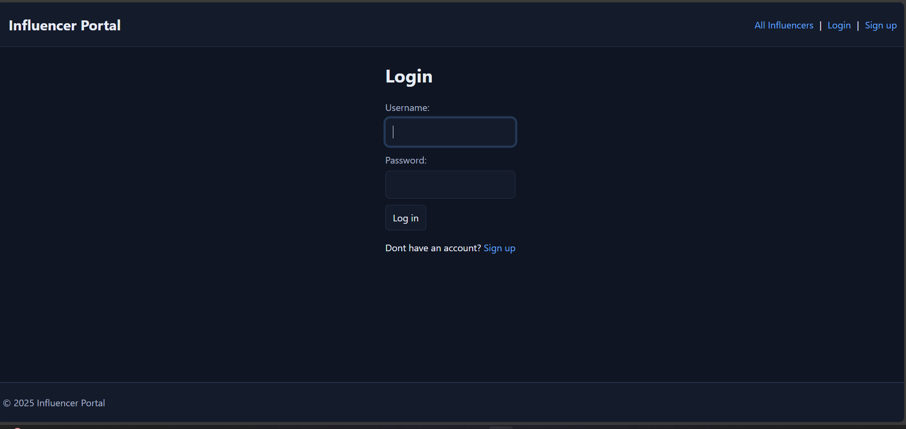

#  Influencer Portal

**Date:** 15 / 10 / 2025  
**Author:** <Your Zaid AL-Bassyouni>  
**Deployed App:** <in-Progress...>

---

##  Screenshot / Logo
> Replace with a logo or app screenshot.
##  Home Page


##  Login Page


##  Sign Up Page


##  All Influencers List


---

##  Description
**Influencer Portal** is a Django web app that helps brands **discover influencers** and creators manage their **public profiles**.  
Users can sign up, create an influencer profile, browse all influencers, and view individual profile pages.

**Why I built it:** I wanted a simple, clean platform to explore **creator discovery** using a modern Django stack, focusing on:
- Clean UI with light/dark tokens
- Simple, privacy-friendly profile model
- Beginner-friendly onboarding (create profile → appear in listings)

**Key features:**
-  Authentication (signup, login, logout)
-  Create & manage your **Influencer Profile**
-  Smart nav: shows **My Profile** if you have one, otherwise **Create Influencer Account**
-  Personalized welcome on the homepage 
-  “All Influencers” directory + profile detail pages

---

##  Getting Started
- **Deployed app:** <in-Progress...>

### Local Setup
```bash
# 1) Clone
git clone https://github.com/Zaid-Bassyouni/GA-Capstone-Project.git
cd /ga-project

# 2) Virtualenv
python -m venv .venv
# Windows (Git Bash / PowerShell)
source .venv/Scripts/activate
# macOS/Linux
# source .venv/bin/activate

# 3) Install deps
pip install -r requirements.txt
# If missing:
# pip install django
# pip freeze > requirements.txt

# 4) Migrate & create admin
python manage.py migrate
python manage.py createsuperuser

# 5) Run
python manage.py runserver
# App: http://127.0.0.1:8000/

